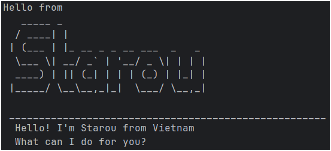

# Starou User Guide



Starou is a simple **task management chatbot** written in **Java**.  
It allows you to add, list, find, mark, unmark, and delete tasks through simple text-based commands.  
All tasks are automatically saved to a local file so you can pick up where you left off next time.

---
## Adding deadlines
You can add a **Deadline task** to keep track of something that must be done before a specific date/time.
### **Usage**
`deadline <description> /by <time>`
with time format: `yyyy-MM-dd HH:mm`

Example: `deadline submit report /by 2025-10-10 23:59`

Expected outcome
```
Got it. I've added this deadline:
 [D][ ] submit report (by: Oct 10 2025, 11:59PM)
Now you have 3 tasks in the list.
```
## Adding todos
A Todo task represents a simple activity without any specific deadline.
### **Usage**
`todo <description>`

Example: `todo read book`

Expected outcome
```
Got it. I've added this task:
 [T][ ] read book
Now you have 4 tasks in the list.
```

## Adding Events
An Event has a start and end time — for example, a meeting or a conference.
### **Usage**
`event <description> /from <start time> /to <end time>` 
with start time and end time following the format: `yyyy-MM-dd HH:mm`

Example: `event project meeting /from 2025-10-12 14:00 /to 2025-10-12 16:00`

Expected outcome
```
Got it. I've added this event:
 [E][ ] project meeting (from: Oct 12 2025, 2:00PM to Oct 12 2025, 4:00PM)
Now you have 5 tasks in the list.
```

## Listing tasks
Display all current tasks in your list.
### **Usage**
`list`

Example: `list`

Expected outcome
```
1. [T][X] read book
2. [D][ ] submit report (by: Oct 10 2025, 11:59PM)
3. [E][ ] project meeting (from: Oct 12 2025, 2:00PM to Oct 12 2025, 4:00PM)
```

## Marking and Unmarking Tasks
Mark a task as done or not done.
### **Usage**
`mark <index>`

`unmark <index>`

Example: `mark 2`

Expected outcome
```
I've marked this task as done:
 [D][X] submit report (by: Oct 10 2025, 11:59PM)
```

## Deleting Tasks
Remove a task from the list by its number.
### **Usage**
`delete <index>`

Example: `delete 1`

Expected outcome
```
Noted. I've removed this task:
 [T][X] read book
Now you have 4 tasks in the list.
```

## Finding Tasks
Find tasks that contain a keyword in their description.
### **Usage**
`find <keyword>`

Example: `find report`

Expected outcome
```
Here are the matching tasks in your list:
1. [D][X] submit report (by: Oct 10 2025, 11:59PM)
```

## Saving and Loading
Starou automatically saves your tasks to: `./data/Starou.txt`
Each time you start the chatbot, it loads the saved tasks automatically.

### **File format**
```
T | 1 | Read book
D | 0 | Submit report | 2025-10-10 23:59
E | 1 | Team meeting | 2025-10-12 14:00 | 2025-10-12 16:00
```

## Exiting the Program
Type: `bye`

Starou will say goodbye and exit gracefully:
```
Bye! Tam biet!!
```

---
## About Starou
- **Developer:** Vu Dinh Khoi (Starou Vu)

- **Language:** Java 17

- **Project Base:** Duke Chatbot Project

- **Storage:** Local text file (data/Starou.txt)

---
## Quick Command Summary

| Command                                                 | Description | Example |
|---------------------------------------------------------|--------------|----------|
| `todo <description>`                                    | Adds a simple task without a deadline. | `todo read book` |
| `deadline <description> /by <time>`                     | Adds a task with a specific deadline. | `deadline submit report /by 2025-10-10 23:59` |
| `event <description> /from <start time> /to <end time>` | Adds an event with start and end times. | `event project meeting /from 2025-10-12 14:00 /to 2025-10-12 16:00` |
| `list`                                                  | Displays all tasks in your list. | `list` |
| `mark <index>`                                          | Marks the specified task as completed. | `mark 2` |
| `unmark <index>`                                        | Marks the specified task as not completed. | `unmark 2` |
| `delete <index>`                                        | Deletes the specified task from the list. | `delete 3` |
| `find <keyword>`                                        | Searches for tasks that contain the given keyword. | `find meeting` |
| `bye`                                                   | Exits the program gracefully. | `bye` |

---
## Tips
- Make sure your time follow the format: `yyyy-MM-dd HH:mm`  
  → Example: `2025-10-10 23:59`
- Use lowercase commands (`todo`, `deadline`, etc.) — commands are case-sensitive.
- Tasks are automatically saved in `data/Starou.txt`.

---

